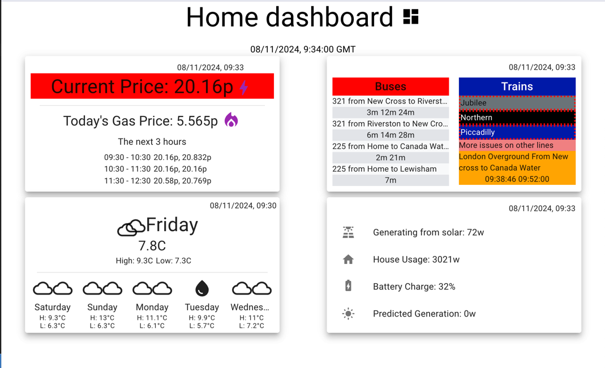
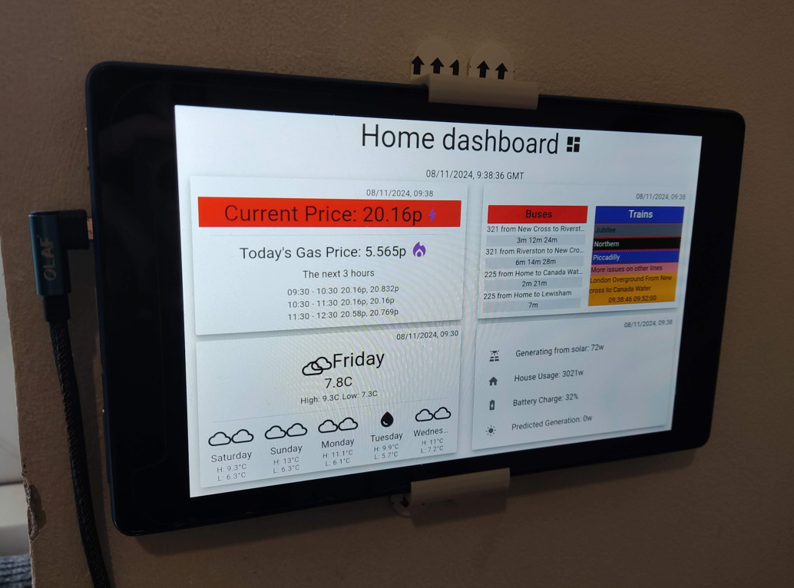

# Home Dashboard Fe app

Home dashboard to display important information at a glance

Specifically written to be displayed on an Amazon fire tablet (it's what I had spare), it's mounted on the wall by 
the door to allow family members view information that might affect their day.

### Development

running locally can be done with a simple 

`npm start`

It will expect the backend sevices to be up an running too in order for it to get the data it needs. For more information 
on setting up you local environment, please take a look at the docker-compose file in the home-dashboard-infra project. If
you've got that already, cloned simply update the environment key's in the docker-compose.yml file then run:

`docker compose up`

### Deployment

This app was written in ReactJs 18, built using docker containers and is deployed on an nginx instance on a raspberrypi. 

- docker build -t generalmeow/home-dashboard-fe .
- docker run -p 3001:80 --name home-dashboard-fe generalmeow/home-dashboard-fe

For more information on how this is deployed, please check out the home-dashboard-infra project.